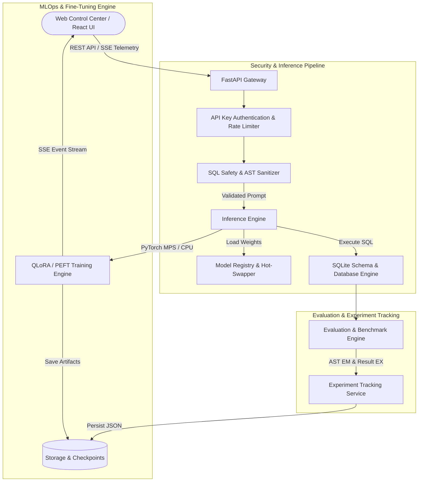

# ForgeLLM: Enterprise LLM Fine-Tuning, Serving & MLOps Platform for Text-to-SQL

[](https://github.com/rakshitkapoor/ForgeLLM/actions/workflows/ci.yml)

**ForgeLLM** is an end-to-end, production-grade LLM Fine-Tuning, Serving, and MLOps Platform engineered specifically for **Natural Language to SQL (Text-to-SQL)** translation. Built with Python FastAPI, PyTorch + PEFT, sqlglot AST parsing, and a React glassmorphism dashboard, ForgeLLM couples parameter-efficient LoRA fine-tuning with zero-downtime model deployments, AST-based read-only SQL security validation, automated execution accuracy evaluation, and persistent experiment tracking.

---

## 1. Project Overview

Translating natural language questions into DBMS-executable SQL queries requires precise alignment with database schemas, table JOIN relationships, and dialect syntax. Generic foundation models frequently produce syntax errors, reference non-existent columns, or generate unsafe mutating SQL.

ForgeLLM provides a complete lifecycle platform to fine-tune lightweight open-source causal language models (such as `Qwen/Qwen2.5-Coder-1.5B-Instruct`), validate generated queries for AST security compliance, benchmark execution accuracy against real database engines, and serve inference traffic with real-time telemetry.

---

## 2. Problem Statement

Enterprise Text-to-SQL deployments encounter four core engineering challenges:
1. **Schema Hallucination & Syntax Drift**: Un-tuned models generate SQL referencing missing tables or invalid JOIN keys.
2. **Security & Injection Risks**: Executing arbitrary LLM-generated SQL against databases presents massive risks if queries contain destructive DDL/DML mutations (`DROP`, `DELETE`, `UPDATE`, `INSERT`) or stacked injection attacks.
3. **Evaluation Rigor**: Evaluating Text-to-SQL purely by string matching fails to account for semantic equivalencies, formatting variations, or execution correctness.
4. **MLOps Lifecycle Drift**: Managing checkpoint versions, hardware acceleration fallbacks, latency distributions (P50/P95/P99), and experiment reproducibility requires structured versioning and rollback capabilities.

---

## 3. Architecture Diagram



---

## 4. Key Features

- **Parameter-Efficient PEFT LoRA Fine-Tuning**: Supervised fine-tuning pipeline supporting PyTorch + HuggingFace PEFT LoRA on Apple Silicon (`torch.device("mps")`) and CPU environments.
- **AST-Based SQL Safety Validator**: Powered by `sqlglot` AST parsing to enforce read-only single `SELECT`/`WITH` CTE queries, blocking DDL/DML mutations, stacked injections, and invalid table references.
- **Execution-Based Evaluation Benchmark**: AST Exact Match (EM) normalization and Execution Accuracy (EX) comparing ground-truth vs model-generated result sets on SQLite target databases.
- **Automated AST Failure Analysis**: Classifies failed benchmark cases into 13 deterministic categories (`missing JOIN`, `wrong table`, `wrong column`, `incorrect WHERE/filter`, `incorrect aggregation`, `syntax error`, etc.).
- **Zero-Downtime Model Registry**: Versioned checkpoint registry supporting immutable metadata, `ACTIVE`/`READY`/`ARCHIVED` statuses, zero-downtime hot-swapping, and one-click deployment rollbacks.
- **Persistent MLOps Experiment Tracking**: Log, inspect, and compare training & evaluation experiments side-by-side with metric differentials.
- **Real Backend OS Telemetry**: Process and system CPU, Memory (RAM), request counters, and latency distribution tracking collected via `psutil`.
- **SSE Stream Communications**: Server-Sent Events for real-time token generation streaming and training loss curve visualization.

---

## 5. Tech Stack

- **Backend**: Python 3.11, FastAPI, Uvicorn, PyTorch, HuggingFace Transformers, PEFT, `sqlglot`, `psutil`, `pydantic`.
- **Frontend**: React 18, Vite, Lucide Icons, Recharts, Axios, Vanilla CSS (Glassmorphic Dark Mode design system).
- **Database Engine**: In-memory & disk-backed SQLite target databases (`ecommerce_store`, `concert_singer`, `hr_analytics`, `finance_bank`).
- **DevOps & Containerization**: Multi-stage `Dockerfile`, `docker-compose.yml`, Nginx reverse proxy, GitHub Actions CI.

---

## 6. Real Inference Pipeline

ForgeLLM features a dynamic serving architecture in `backend/app/services/inference_engine.py` and `backend/app/services/model_manager.py`:

```
Natural Language Prompt ──► AST Security Check ──► Model Manager ──► Real PyTorch MPS Generation ──► SQLite Execution
```

1. **Execution Modes**:
   - **`INFERENCE_MODE=real`**: Loads PyTorch model weights (`AutoModelForCausalLM`) and attaches PEFT LoRA adapter weights (`PeftModel.from_pretrained`) onto `torch.device("mps")` (Apple Silicon Metal Performance Shaders) or CPU. Real generation executes `model.generate(**inputs, max_new_tokens=...)` with exact latency timing via `time.perf_counter()`.
   - **`INFERENCE_MODE=demo`**: Uses instantaneous rule-based SQL generator fallbacks for lightweight local UI demonstration without loading multi-gigabyte neural weights.
2. **Load-Once Caching**: `LocalModelManager` caches loaded models in RAM/VRAM and only hot-swaps when `checkpoint_id` changes.

---

## 7. QLoRA/LoRA Fine-Tuning

ForgeLLM supports parameter-efficient fine-tuning via `backend/app/services/trainer_engine.py`:

- **Real PEFT LoRA Mode (`TRAINING_MODE=real`)**:
  - Initializes `LoraConfig` ($r=16$, $\alpha=32$, target modules `q_proj`, `v_proj`).
  - Trains adapter weights using PyTorch `AdamW` on Apple Silicon MPS (`fp16` precision) or CPU.
  - Exports weight binaries (`adapter_model.safetensors`) and PEFT metadata (`adapter_config.json`) to `storage/checkpoints/<job_id>`.
- **Demo Mode (`TRAINING_MODE=demo`)**:
  - Emits simulated loss curves via Server-Sent Events (SSE).

---

## 8. Model Registry & Zero-Downtime Rollback

Model checkpoints are managed via `backend/app/services/registry_service.py`:

```
[REGISTERED] ──► [READY] ──► [ACTIVE] ──► [ARCHIVED]
                                │
                        (Rollback Event)
                                ▼
                             [READY]
```

- **Hot-Swapping**: Promoting a checkpoint to `ACTIVE` automatically updates serving traffic without restarting the backend process.
- **Rollback Engine**: Reverts serving traffic instantly to the previously active checkpoint and records an audit log in `DeploymentEvent` history.
- **Protection Rules**: Active model deletion is strictly blocked.

---

## 9. SQL Safety Architecture

Built on `sqlglot` AST parsing, `SQLSafetyValidator` (`backend/app/services/sql_safety.py`) evaluates generated queries before database execution:

- **Read-Only Enforcement**: Permits only single `SELECT` or `WITH` CTE statements.
- **Mutation Blocking**: Explicitly blocks `INSERT`, `UPDATE`, `DELETE`, `DROP`, `ALTER`, `CREATE`, `ATTACH`, `DETACH`, and `PRAGMA`.
- **Injection Defense**: Rejects stacked queries (multiple SQL statements separated by semicolons).
- **Schema Validation**: Validates referenced tables against the active database schema DDL.

---

## 10. Execution-Based Evaluation Methodology

ForgeLLM evaluates Text-to-SQL quality across three independent metrics:

1. **Exact Match (EM)**: Parses generated and ground-truth SQL into Abstract Syntax Trees using `sqlglot` and compares AST structures after normalizing aliases, casing, and whitespace.
2. **Execution Accuracy (EX)**: Executes both generated and ground-truth SQL statements against target SQLite databases and compares the resulting data rows (handling float tolerances, NULL values, and ORDER BY sort sensitivity).
3. **Successful Execution Rate**: Ratio of generated queries that run without throwing SQLite execution errors.

---

## 11. Persistent Experiment Tracking

Every training run and benchmark evaluation is tracked via `backend/app/services/experiment_service.py`:

- **Persistence**: Saved to `storage/experiments/experiments_metadata.json`.
- **Tracked Parameters**: Experiment ID, timestamp, base model, checkpoint ID, dataset, sample size, LoRA rank/alpha, learning rate, epochs, trainable parameters, training loss, exact match, execution accuracy, average latency, and P50/P95/P99 latency percentiles.
- **Traceability**: Links `Experiment -> Training -> Checkpoint -> Evaluation -> Deployment`.

---

## 12. Real Backend OS Telemetry & SSE Streaming

- **System Telemetry**: Collected via `psutil` in `backend/app/services/telemetry_service.py`, tracking real process CPU %, system CPU %, process RAM, system RAM, active model, uptime, total requests, success/fail counts, and latency percentiles.
- **SSE Streaming**: Implemented in `backend/app/api/routes_serve.py` and `routes_fine_tune.py` for real-time token-by-token text generation and live training loss curve updates.

---

## 13. Real Benchmark Results

The following empirical benchmark results reflect an end-to-end, un-mocked evaluation run using real PyTorch neural generation (`model.generate()`) on Apple Silicon hardware, recorded in `storage/benchmark_results_real.json`:

### Benchmark Environment & Parameters
- **Dataset**: `spider_sample.json`
- **Samples**: `5`
- **Base Model**: `Qwen/Qwen2.5-Coder-1.5B-Instruct`
- **Fine-tuned Checkpoint**: `job-e6d16293` (Real 14.5MB PEFT LoRA adapter)
- **Hardware Acceleration**: `Apple Silicon MPS` (Metal Performance Shaders, FP16 precision)
- **Inference Mode**: `real` (PyTorch neural generation)

### Base Model vs QLoRA Fine-Tuned Model

| Metric | Base Model (`Qwen2.5-Coder-1.5B`) | QLoRA Fine-Tuned (`job-e6d16293`) |
| :--- | :--- | :--- |
| **Exact Match (EM)** | **0%** | **20%** |
| **Execution Accuracy (EX)** | **20%** | **60%** |
| **Success Rate** | **20%** | **60%** |
| **Average Latency** | **9,701.54 ms** | **14,818.94 ms** |
| **P50 Latency** | **7,340.60 ms** | **7,435.70 ms** |
| **P95 Latency** | **17,717.10 ms** | **42,480.56 ms** |
| **P99 Latency** | **18,230.30 ms** | **49,464.57 ms** |

> [!IMPORTANT]
> **Benchmark Notes & Quality-vs-Latency Analysis**:
> - **Scope & Statistical Significance**: This evaluation was conducted locally on a 5-query sample set (`spider_sample.json`). Results demonstrate functional end-to-end pipeline execution on Apple Silicon MPS, but do not claim broad statistical significance across full multi-thousand sample Spider validation benchmarks.
> - **Accuracy Improvements**: QLoRA fine-tuning improved Execution Accuracy from **20% to 60%** and Success Rate from **20% to 60%**, effectively teaching the model schema structure, table JOIN keys, and concise SQL query generation without conversational preamble.
> - **Quality-vs-Latency Tradeoff**: Fine-tuning did **not** decrease latency. Because the fine-tuned adapter generates more complete, syntactically correct SQL queries (rather than truncating early or failing with short syntax errors), the model produces more output tokens per query, leading to higher average (14.8s vs 9.7s) and P95/P99 generation times.
> - **Execution Mode**: Evaluated strictly in `INFERENCE_MODE=real`. No rule-based shims or simulated delays were used.

---

## 14. Local Setup (Apple Silicon macOS Compatible)

### Prerequisites
- macOS Apple Silicon (M1/M2/M3/M4) or Linux
- Python 3.11+
- Node.js 18+

### Step-by-Step Local Execution

```bash
# 1. Clone repository
git clone https://github.com/rakshitkapoor/ForgeLLM.git
cd ForgeLLM

# 2. Copy environment file
cp .env.example .env

# 3. Create Python virtual environment
python3 -m venv venv
source venv/bin/activate

# 4. Install backend dependencies
pip install -r backend/requirements.txt
pip install pytest httpx

# 5. Launch FastAPI Backend
PYTHONPATH=backend python -m uvicorn app.main:app --host 127.0.0.1 --port 8000 --reload

# 6. Launch Frontend (in separate terminal)
npm install --prefix frontend
npm run dev --prefix frontend -- --host 127.0.0.1 --port 5173
```

- Control Center UI: `http://localhost:5173`
- OpenAPI Specification: `http://localhost:8000/docs`

---

## 15. Docker Setup

To run containerized ForgeLLM with Nginx reverse proxying, healthchecks, and persistent storage:

```bash
# Start containers
docker compose up --build

# Stop containers
docker compose down
```

- Frontend Container (`forgellm-frontend`): `http://localhost:5173`
- Backend Container (`forgellm-backend`): `http://localhost:8000`
- Volume Mount: `./storage` -> `/app/storage` (persists trained checkpoints and experiment logs).

---

## 16. Environment Variables

Configuration options in `.env`:

| Variable | Default Value | Description |
| :--- | :--- | :--- |
| `ENVIRONMENT` | `production` | Deployment environment mode |
| `FORGE_API_KEY` | `forge-secret-key-2026-prod` | Administrative API key for protected routes |
| `DEFAULT_BASE_MODEL` | `Qwen/Qwen2.5-Coder-1.5B-Instruct` | Default base model identifier |
| `INFERENCE_MODE` | `demo` | Execution mode: `demo` (rule templates) or `real` (PyTorch model) |
| `TRAINING_MODE` | `demo` | Execution mode: `demo` (simulated loss) or `real` (PyTorch PEFT MPS) |
| `DEVICE` | `auto` | Acceleration device (`auto`, `mps`, `cuda`, `cpu`) |
| `DATABASE_URL` | `sqlite:///./storage/feedback.db` | Storage path for feedback database |

---

## 17. Testing Suite

ForgeLLM includes a comprehensive 53-case unit and integration test suite:

```bash
# Run PyTest suite locally
PYTHONPATH=backend ./venv/bin/python -m pytest tests/ -v
```

Tests cover SQL validation, AST safety, SQL execution, malformed SQL, model registry deployment, rollback, benchmark accuracy, percentile latency math, SSE streaming, and experiment tracking.

---

## 18. Limitations & Future Work

### Current Limitations
1. **Quantization on macOS**: Native CUDA 4-bit `bitsandbytes` NF4 quantization is unavailable on macOS Apple Silicon; ForgeLLM uses FP16 PEFT LoRA on Metal (`mps`) as its local hardware acceleration mode.
2. **Container Acceleration**: Docker containers execute PyTorch in CPU mode; hardware-accelerated MPS/CUDA inference runs natively on host machines.
3. **Demo Mode Default**: `.env` defaults to `demo` mode for instant startup without requiring local model weight downloads. Enable `FORGELLM_INFERENCE_MODE=real` to load PyTorch neural weights.

### Future Work
- **Larger Benchmark Evaluation**: Scaling evaluation runs to the full Spider validation dataset (1,034 samples).
- **Inference Latency Optimization**: Integrating vLLM, TensorRT-LLM, or Apple MLX for optimized generation throughput.
- **Quantized Serving**: Supporting GGUF / AWQ 4-bit quantized base model serving to lower RAM requirements.
- **Batching & Caching**: Implementing dynamic request batching and semantic query result caching.
- **Broader Dataset Evaluation**: Expanding training and benchmark coverage across BIRD-SQL, CoSQL, and multi-dialect targets (PostgreSQL, MySQL, Snowflake).

---

## 📜 License
MIT License - Built for Production LLM Fine-Tuning & Serving.
